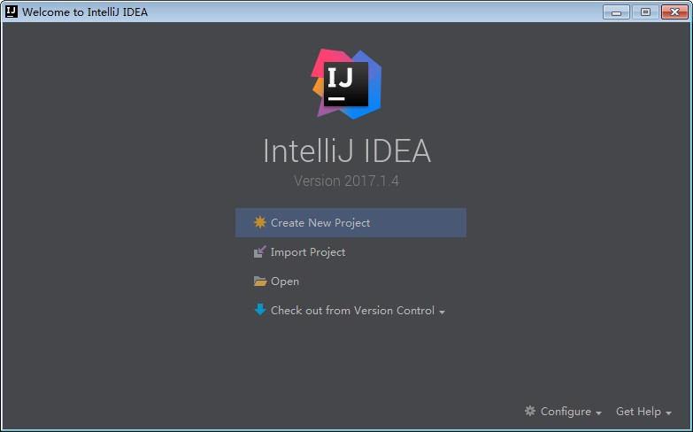
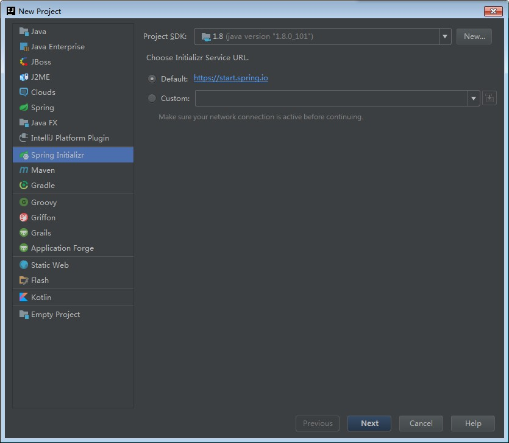
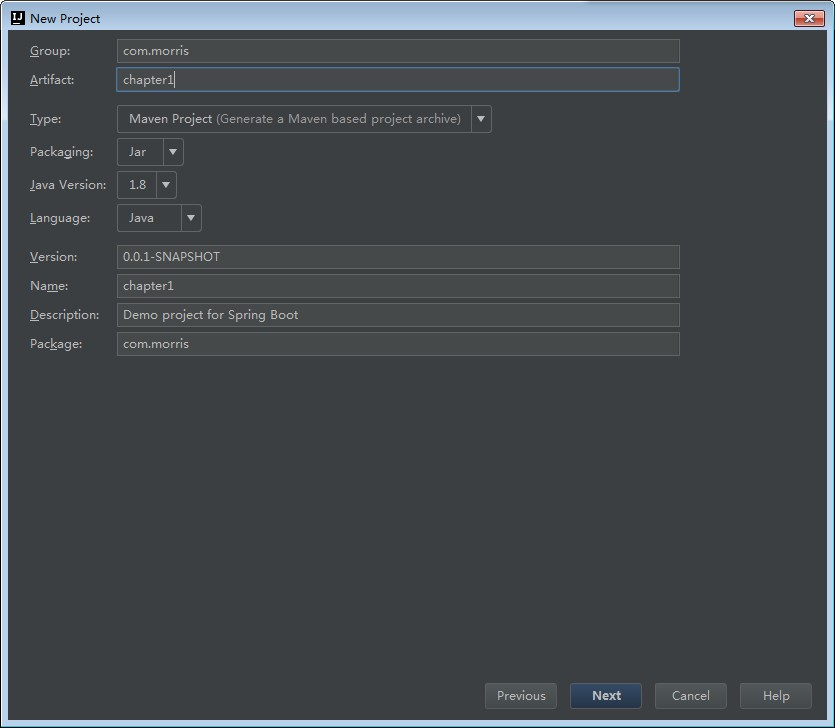
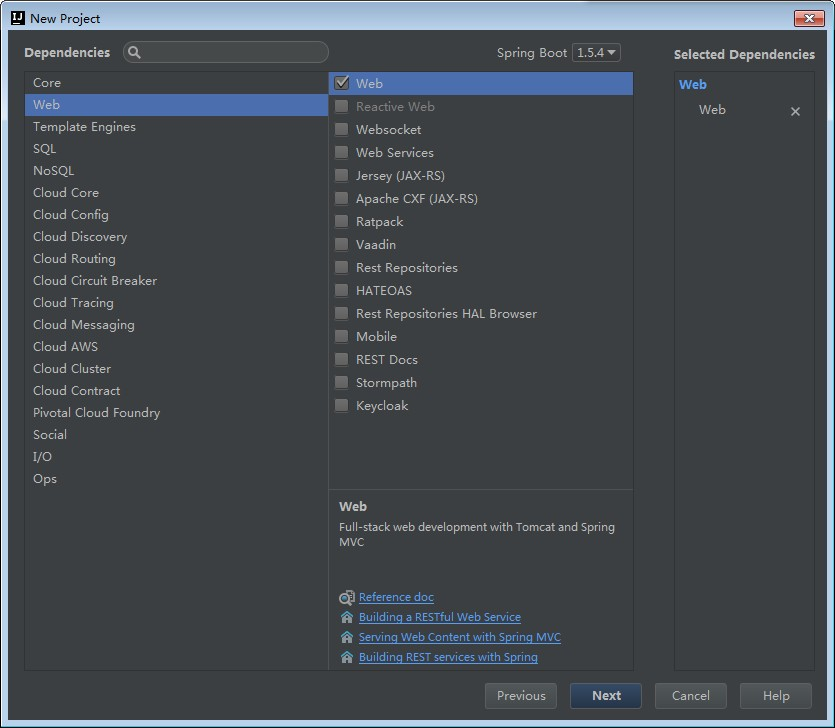
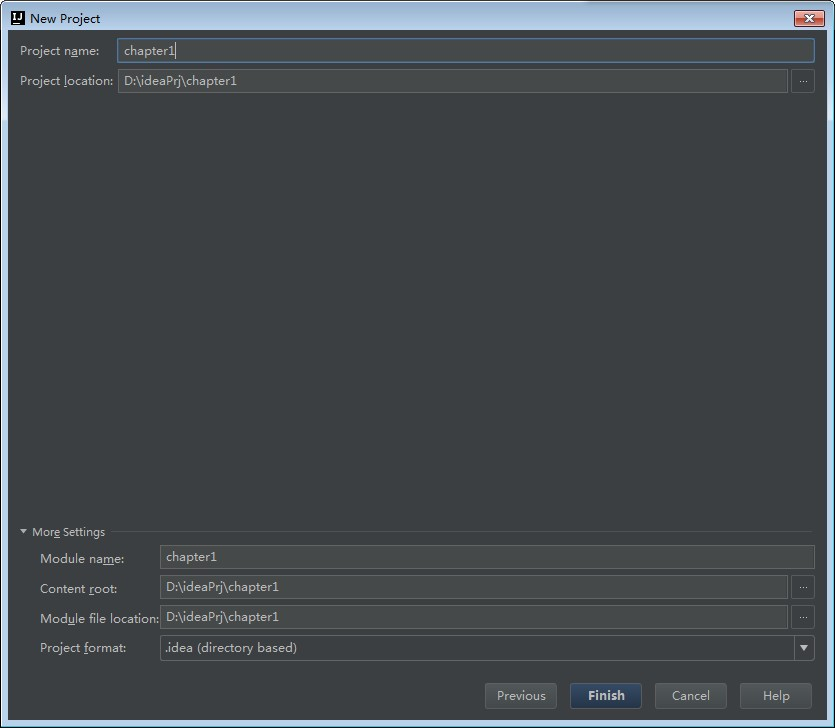
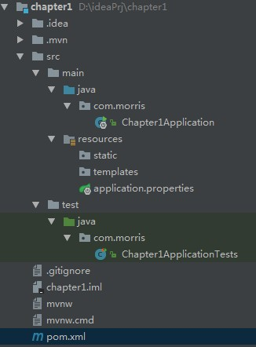

1. 使用IDEA新建一个spring boot项目








2. 建好的项目目录结构如下:



通过上面步骤完成了基础项目的创建，如上图所示，Spring Boot的基础结构共三个文件（具体路径根据用户生成项目时填写的Group所有差异）：

src/main/java下的程序入口：Chapter1Application

src/main/resources下的配置文件：application.properties

src/test/下的测试入口：Chapter1ApplicationTests

生成的Chapter1Application和Chapter1ApplicationTests类都可以直接运行来启动当前创建的项目，由于目前该项目未配合任何数据访问或Web模块，程序会在加载完Spring之后结束运行。

3. 引入web模块
当前的pom.xml内容如下，仅引入了两个模块：

spring-boot-starter：核心模块，包括自动配置支持、日志和YAML

spring-boot-starter-test：测试模块，包括JUnit、Hamcrest、Mockito

引入Web模块，需添加spring-boot-starter-web模块

```xml
<?xml version="1.0" encoding="UTF-8"?>
<project xmlns="http://maven.apache.org/POM/4.0.0" xmlns:xsi="http://www.w3.org/2001/XMLSchema-instance"
	xsi:schemaLocation="http://maven.apache.org/POM/4.0.0 http://maven.apache.org/xsd/maven-4.0.0.xsd">
	<modelVersion>4.0.0</modelVersion>

	<groupId>com.morris</groupId>
	<artifactId>chapter1</artifactId>
	<version>0.0.1-SNAPSHOT</version>
	<packaging>jar</packaging>

	<name>chapter1</name>
	<description>Demo project for Spring Boot</description>

	<parent>
		<groupId>org.springframework.boot</groupId>
		<artifactId>spring-boot-starter-parent</artifactId>
		<version>1.5.4.RELEASE</version>
		<relativePath/> <!-- lookup parent from repository -->
	</parent>

	<properties>
		<project.build.sourceEncoding>UTF-8</project.build.sourceEncoding>
		<project.reporting.outputEncoding>UTF-8</project.reporting.outputEncoding>
		<java.version>1.8</java.version>
	</properties>

	<dependencies>
		<dependency>
			<groupId>org.springframework.boot</groupId>
			<artifactId>spring-boot-starter-web</artifactId>
		</dependency>

		<dependency>
			<groupId>org.springframework.boot</groupId>
			<artifactId>spring-boot-starter-test</artifactId>
			<scope>test</scope>
		</dependency>
	</dependencies>

	<build>
		<plugins>
			<plugin>
				<groupId>org.springframework.boot</groupId>
				<artifactId>spring-boot-maven-plugin</artifactId>
			</plugin>
		</plugins>
	</build>


</project>


```

4. 编写HelloWorld服务

```java
package com.morris.web;

import org.springframework.web.bind.annotation.RequestMapping;
import org.springframework.web.bind.annotation.RestController;

/**
 * Created by lian.chen on 2017/6/12.
 */
@RestController
public class HelloWorldController {

    @RequestMapping("hello")
    public String hello() {
        return "hello world";
    }
}

```

5. 运行Chapter1Application中的main方法，启动项目


6. 浏览器输入 http://localhost:8080/hello 显示 hello world

