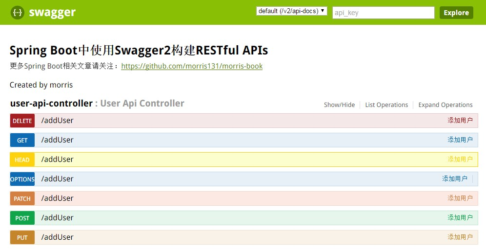

由于Spring Boot能够快速开发、便捷部署等特性，相信有很大一部分Spring Boot的用户会用来构建RESTful API。而我们构建RESTful API的目的通常都是由于多终端的原因，这些终端会共用很多底层业务逻辑，因此我们会抽象出这样一层来同时服务于多个移动端或者Web前端。

这样一来，我们的RESTful API就有可能要面对多个开发人员或多个开发团队：IOS开发、Android开发或是Web开发等。为了减少与其他团队平时开发期间的频繁沟通成本，传统做法我们会创建一份RESTful API文档来记录所有接口细节，然而这样的做法有以下几个问题：
* 由于接口众多，并且细节复杂（需要考虑不同的HTTP请求类型、HTTP头部信息、HTTP请求内容等），高质量地创建这份文档本身就是件非常吃力的事，下游的抱怨声不绝于耳。
* 随着时间推移，不断修改接口实现的时候都必须同步修改接口文档，而文档与代码又处于两个不同的媒介，除非有严格的管理机制，不然很容易导致不一致现象。

为了解决上面这样的问题，本文将介绍RESTful API的重磅好伙伴Swagger2，它可以轻松的整合到Spring Boot中，并与Spring MVC程序配合组织出强大RESTful API文档。它既可以减少我们创建文档的工作量，同时说明内容又整合入实现代码中，让维护文档和修改代码整合为一体，可以让我们在修改代码逻辑的同时方便的修改文档说明。另外Swagger2也提供了强大的页面测试功能来调试每个RESTful API。

下面以[构建RESTful API与单元测试](构建RESTfulAPI与单元测试.md)的工程为基础，添加Swagger2。

1. 添加Swagger2依赖

详细代码参考[pom.xml](projects/chapter5/pom.xml)

```xml
		<dependency>
			<groupId>io.springfox</groupId>
			<artifactId>springfox-swagger2</artifactId>
			<version>2.2.2</version>
		</dependency>

		<dependency>
			<groupId>io.springfox</groupId>
			<artifactId>springfox-swagger-ui</artifactId>
			<version>2.2.2</version>
		</dependency>
```

2. 创建Swagger2配置类

详细代码参考[Swagger2.java](projects/chapter5/src/main/java/com/morris/Swagger2.java)

```java
package com.morris;

import org.springframework.context.annotation.Bean;
import org.springframework.context.annotation.Configuration;
import springfox.documentation.builders.ApiInfoBuilder;
import springfox.documentation.builders.PathSelectors;
import springfox.documentation.builders.RequestHandlerSelectors;
import springfox.documentation.service.ApiInfo;
import springfox.documentation.spi.DocumentationType;
import springfox.documentation.spring.web.plugins.Docket;
import springfox.documentation.swagger2.annotations.EnableSwagger2;

/**
 * Created by lian.chen on 2017/6/15.
 */
@Configuration
@EnableSwagger2
public class Swagger2 {

    @Bean
    public Docket createRestApi() {
        return new Docket(DocumentationType.SWAGGER_2)
                .apiInfo(apiInfo())
                .select()
                .apis(RequestHandlerSelectors.basePackage("com.morris.web"))
                .paths(PathSelectors.any())
                .build();
    }
    private ApiInfo apiInfo() {
        return new ApiInfoBuilder()
                .title("Spring Boot中使用Swagger2构建RESTful APIs")
                .description("更多Spring Boot相关文章请关注：https://github.com/morris131/morris-book")
                .termsOfServiceUrl("https://github.com/morris131/morris-book")
                .contact("morris")
                .version("1.0")
                .build();
    }
}

```
> 如上代码所示，通过@Configuration注解，让Spring来加载该类配置。再通过@EnableSwagger2注解来启用Swagger2。再通过createRestApi函数创建Docket的Bean之后，apiInfo()用来创建该Api的基本信息（这些基本信息会展现在文档页面中）。select()函数返回一个ApiSelectorBuilder实例用来控制哪些接口暴露给Swagger来展现，本例采用指定扫描的包路径来定义，Swagger会扫描该包下所有Controller定义的API，并产生文档内容（除了被@ApiIgnore指定的请求）。

3. 添加文档内容

在完成了上述配置后，其实已经可以生产文档内容，但是这样的文档主要针对请求本身，而描述主要来源于函数等命名产生，对用户并不友好，我们通常需要自己增加一些说明来丰富文档内容。如下所示，我们通过@ApiOperation注解来给API增加说明、通过@ApiImplicitParams、@ApiImplicitParam注解来给参数增加说明。

详细代码参考[UserApiController.java](projects/chapter5/src/main/java/com/morris/web/UserApiController.java)

```java
package com.morris.web;

import com.morris.domain.User;
import io.swagger.annotations.ApiImplicitParam;
import io.swagger.annotations.ApiOperation;
import org.springframework.web.bind.annotation.ModelAttribute;
import org.springframework.web.bind.annotation.PathVariable;
import org.springframework.web.bind.annotation.RequestMapping;
import org.springframework.web.bind.annotation.RestController;

import java.util.*;

/**
 * Created by lian.chen on 2017/6/15.
 */
@RestController
public class UserApiController {

    static Map<Long, User> userMap = Collections.synchronizedMap(new HashMap<Long, User>());

    @ApiOperation(value = "添加用户", notes = "根据User对象添加用户")
    @ApiImplicitParam(name = "user", value = "待创建的用户实体")
    @RequestMapping("addUser")
    public String addUser(@ModelAttribute User user) {
        userMap.put(user.getId(), user);
        return "success";
    }

    @ApiOperation(value = "获取用户列表", notes = "")
    @RequestMapping("getList")
    public List<User> getList() {
        List<User> users = new ArrayList<>(userMap.values());
        return users;
    }

    @ApiOperation(value = "查询用户", notes = "根据用户ID获取用户详情")
    @ApiImplicitParam(name = "id", value = "用户ID")
    @RequestMapping("getById")
    public User getById(@PathVariable Long id) {
        return userMap.get(id);
    }

    @ApiOperation(value = "删除用户", notes = "根据用户ID删除用户")
    @ApiImplicitParam(name = "id", value = "用户ID")
    @RequestMapping("delUser")
    public String delUser(@PathVariable Long id) {
        userMap.remove(id);
        return "success";
    }

}

```

4. 启动项目
访问地址：http://localhost:8080/swagger-ui.html，页面如下：


5. API文档访问与调试

Swagger除了查看接口功能外，还提供了调试测试功能，我们可以点击上图中右侧的Model Schema（黄色区域：它指明了User的数据结构），此时Value中就有了user对象的模板，我们只需要稍适修改，点击下方“Try it out！”按钮，即可完成了一次请求调用！

此时，你也可以通过几个GET请求来验证之前的POST请求是否正确。

相比为这些接口编写文档的工作，我们增加的配置内容是非常少而且精简的，对于原有代码的侵入也在忍受范围之内。因此，在构建RESTful API的同时，加入swagger来对API文档进行管理，是个不错的选择。
